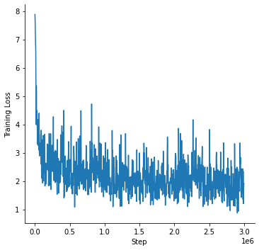

# Language Model for Historic Dutch

In this repository we open source a language model for Historic Dutch, trained on the
[Delpher Corpus](https://www.delpher.nl/over-delpher/delpher-open-krantenarchief/download-teksten-kranten-1618-1879),
that include digitized texts from Dutch newspapers, ranging from 1618 to 1879.

# Changelog

* 13.12.2021: Initial version of this repository.

# Model Zoo

The following models for Historic Dutch are available on the Hugging Face Model Hub:

| Model identifier                       | Model Hub link
| -------------------------------------- | -------------------------------------------------------------------
| `dbmdz/bert-base-historic-dutch-cased` | [here](https://huggingface.co/dbmdz/bert-base-historic-dutch-cased)

# Stats

The download urls for all archives can be found [here](delpher-corpus.urls).

We then used the awesome `alto-tools` from @cneud from [this](https://github.com/cneud/alto-tools)
repository to extract plain text. The following table shows the size overview per year range:

| Period    | Extracted plain text size
| --------- | -------------------------:
| 1618-1699 | 170MB
| 1700-1709 | 103MB
| 1710-1719 |  65MB
| 1720-1729 | 137MB
| 1730-1739 | 144MB
| 1740-1749 | 188MB
| 1750-1759 | 171MB
| 1760-1769 | 235MB
| 1770-1779 | 271MB
| 1780-1789 | 414MB
| 1790-1799 | 614MB
| 1800-1809 | 734MB
| 1810-1819 | 807MB
| 1820-1829 | 987MB
| 1830-1839 | 1.7GB
| 1840-1849 | 2.2GB
| 1850-1854 | 1.3GB
| 1855-1859 | 1.7GB
| 1860-1864 | 2.0GB
| 1865-1869 | 2.3GB
| 1870-1874 | 1.9GB
| 1875-1876 | 867MB
| 1877-1879 | 1.9GB

The total training corpus consists of 427,181,269 sentences and 3,509,581,683 tokens (counted via `wc`),
resulting in a total corpus size of 21GB.

The following figure shows an overview of the number of chars per year distribution:


# Language Model Pretraining

We use the official [BERT](https://github.com/google-research/bert) implementation using the following command
to train the model:

```bash
python3 run_pretraining.py --input_file gs://delpher-bert/tfrecords/*.tfrecord \
--output_dir gs://delpher-bert/bert-base-historic-dutch-cased \
--bert_config_file ./config.json \
--max_seq_length=512 \
--max_predictions_per_seq=75 \
--do_train=True \
--train_batch_size=128 \
--num_train_steps=3000000 \
--learning_rate=1e-4 \
--save_checkpoints_steps=100000 \
--keep_checkpoint_max=20 \
--use_tpu=True \
--tpu_name=electra-2 \
--num_tpu_cores=32
```

We train the model for 3M steps using a total batch size of 128 on a v3-32 TPU. The pretraining loss curve can be seen
in the next figure:



# Evaluation

We evaluate our model on the preprocessed Europeana NER dataset for Dutch, that was presented in the
["Data Centric Domain Adaptation for Historical Text with OCR Errors"](https://github.com/stefan-it/historic-domain-adaptation-icdar) paper.

The data is available in their repository. We perform a hyper-parameter search for:

* Batch sizes: `[4, 8]`
* Learning rates: `[3e-5, 5e-5]`
* Number of epochs: `[5, 10]`

and report averaged F1-Score over 5 runs with different seeds. We also include [hmBERT](https://github.com/stefan-it/clef-hipe/blob/main/hlms.md) as baseline model.

Results:

| Model               | F1-Score (Dev / Test)
| ------------------- | ---------------------
| hmBERT              | (82.73) / 81.34
| März et al. (2021) | - / 84.2
| Ours                | (89.73) / 87.45

# License

All models are licensed under [MIT](LICENSE).

# Acknowledgments

Research supported with Cloud TPUs from Google's TPU Research Cloud (TRC) program, previously known as
TensorFlow Research Cloud (TFRC). Many thanks for providing access to the TRC ❤️

We thank Clemens Neudecker for maintaining the amazing [ALTO tools](https://github.com/cneud/alto-tools)
that were used for parsing the Delpher Corpus XML files.

Thanks to the generous support from the [Hugging Face](https://huggingface.co/) team,
it is possible to download both cased and uncased models from their S3 storage 🤗
